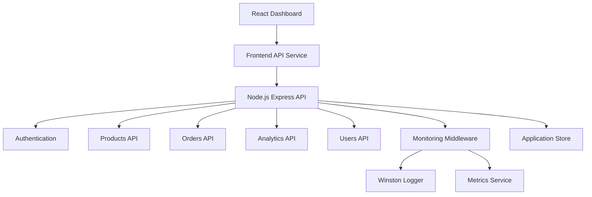

# System Architecture

## Overview

The Day 14 system integrates a frontend dashboard with a Node.js REST API.

The system demonstrates:

- Frontend-backend communication
- JWT authentication
- REST API integration
- Product browsing
- Order creation
- Analytics retrieval
- Error handling
- Monitoring
- Logging
- Metrics
- End-to-end data flow

## Architecture Diagram



## Request Flow

```text
React Dashboard
      |
      v
Frontend API Service
      |
      | HTTP + JSON
      | Authorization: Bearer JWT
      v
Node.js / Express
      |
      +---- Authentication
      |
      +---- Products
      |
      +---- Orders
      |
      +---- Analytics
      |
      +---- Users
      |
      v
Monitoring Middleware
      |
      +---- Request Metrics
      |
      +---- Error Logging
      |
      v
Application Data Store
```

## Authentication Flow

```text
User
  |
  v
Login
  |
  v
JWT Access Token
  |
  v
Frontend localStorage
  |
  v
Authorization Header
  |
  v
Protected Backend Endpoint
```

## Order Data Flow

```text
User
  |
  v
Login
  |
  v
Browse Products
  |
  v
Select Product
  |
  v
Create Order
  |
  v
Validate Product
  |
  v
Validate Stock
  |
  v
Calculate Total
  |
  v
Store Order
  |
  v
Return Order Response
  |
  v
Retrieve Orders
  |
  v
Retrieve Analytics
```

## Cross-System Error Flow

```text
Frontend Request
      |
      v
Backend Endpoint
      |
      v
Validation / Authentication
      |
      +---- Success ----> JSON Response
      |
      +---- Error ------> Structured Error
                              |
                              v
                       Frontend Error Handler
```

## Monitoring Architecture

```text
HTTP Request
     |
     v
Monitoring Middleware
     |
     +---- Duration
     +---- Method
     +---- URL
     +---- Status
     +---- User
     |
     v
Monitoring Service
     |
     +---- Request Metrics
     +---- Error Rate
     +---- Uptime
     +---- Memory
     |
     v
Winston Logger
     |
     +---- Console
     +---- combined.log
     +---- error.log
```

## Main Components

### Frontend

The frontend API service provides:

- API requests
- Authentication token management
- User APIs
- Product APIs
- Order APIs
- Analytics APIs
- Error propagation

### Backend

The backend provides:

- REST endpoints
- JWT authentication
- Business logic
- Validation
- Error handling
- Monitoring
- Logging

### Monitoring

Monitoring provides:

- Request count
- Request duration
- Error count
- Error rate
- Uptime
- Memory usage
- Process information

## Integration Principles

- JSON is used for request and response data.
- Authentication uses JWT Bearer tokens.
- REST resources use predictable URLs.
- Errors use structured responses.
- Monitoring runs across all HTTP requests.
- Frontend and backend communicate through the API service layer.
- The system is designed to support future persistence layers.

## Day 14 Architecture Goal

The architecture demonstrates a complete integration path from frontend request to backend processing, monitoring, response handling, and user-facing application behavior.